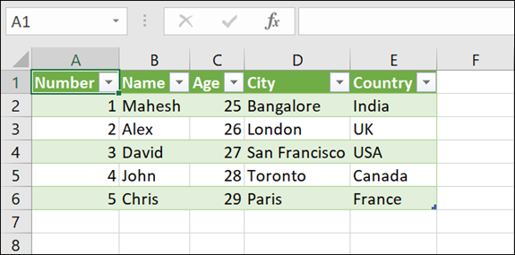

<!-- Badges session -->

  
  <!-- languages -->
  
  <!-- repo size -->
  
  <!-- last commit -->
  
  <!-- licence MIT -->
  

<!--Banner session-->

<!--About session-->
<h1 align="center">Formação Python Developer Digital Innovation One</h1>

# Criando uma API com Flask no Ambiente COLAB

## Objetivo:
Para este projeto o desafio final envolve a entrega de uma API desenvolvida no framework Flask utilizando a Plataforma COLAB. O Objetivo principal está relacionado com a leitura de uma planilha de dados no formato JSON utilizando uma API no ambiente de desenvolvimento colaborativo COLAB.

<!--Banner session-->

### Neste repositório, insira todos os links e arquivos necessários para seu projeto, seja um arquivo de banco de dados ou um link para o template no Figma.
 
Dica: Se o expert forneceu um repositório Github, você pode dar um "fork" no repositório dele para organizar suas alterações e evoluções mantendo uma referência direta ao código-fonte original.
 

### Entregável:
Para este projeto o desafio final envolve a entrega de uma API desenvolvida no framework Flask utilizando a Plataforma COLAB. O Objetivo principal está relacionado com a leitura de uma planilha de dados no formato JSON utilizando uma API no ambiente de desenvolvimento colaborativo COLAB.

Nosso servidor FastAPI deve trazer a planilha gerada em JSON, assim, como estamos apresentando um “Hello Word” neste exemplo. Para isso, deve ser dado um {Public_URL}/index no navegador para chegar ao nosso endpoint, pois criamos apenas uma rota, ou seja , /index . 

<!--Orientador session-->
### Orientador:
Diego Renan 
Education Tech Lead, DIO

##
<!--Bottom session-->
<h4 align=center>Made with by <a href="https://www.linkedin.com/in/gdmacedo/">Macedo, Glener Diniz</a></h4>

